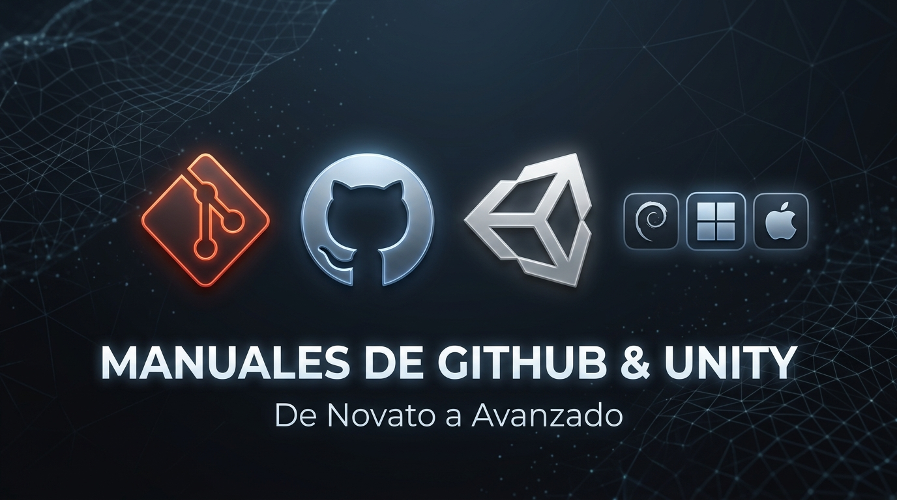

# Manuales Oficiales de GitHub & Unity: De Novato a Avanzado 🚀



[](LICENSE)
[](https://github.com/sajitario2004/manualGit)
[](https://github.com/sajitario2004/manualGit/actions)
[](UNITY/)
[](manual-github-debian-linux.md)
[](manual-github-powershell-windows.md)
[](manual-github-macos-apple-silicon.md)
[](.)

Colección completa y exhaustiva de manuales técnicos profesionales para dominar el control de versiones con **Git**, todo el ecosistema colaborativo de **GitHub**, y el desarrollo profesional de videojuegos con **Unity y GitHub**, desde los fundamentos más elementales hasta flujos avanzados de CI/CD, productividad moderna, seguridad y resolución de incidentes críticos en producción.

Cada manual está **100% adaptado a las herramientas, rutas, gestores de credenciales y particularidades de su sistema operativo**, e incluye:
- **Comandos listos para copiar y pegar** con explicación detallada de cada instrucción (`¿Qué hace este comando?`).
- **Flujos duales:** Comandos para **Terminal (CLI)** y pasos detallados con capturas de pantalla para **GitHub Desktop (GUI)**.
- **Solución por temas a la edición concurrente del mismo archivo** (escenarios resueltos paso a paso).
- **Herramientas modernas de productividad** (Git Worktrees, Git Bisect & Blame, GitHub Codespaces, GitHub Copilot CLI, Pre-commit).
- **Catálogo maestro de incidentes reales** con guías de recuperación paso a paso.
- Versiones en **Markdown (`.md`)** y en **PDF imprimible de alta resolución (`.pdf`)** con portadas dedicadas, estilo visual oscuro para terminales y tablas comparativas.

---

## ⚡ Tarjetas de Referencia Rápida (Cheatsheets de 1 Página)

Para tener siempre a mano junto al teclado o pegar en tu panel de trabajo:

| Cheatsheet | Enfoque Principal | Enlace |
| :--- | :--- | :---: |
| **Git & GitHub en 1 Página** | Comandos diarios, ramas, stash, resolución de conflictos y rescates con `reflog`. | [Ver Cheatsheet](CHEATSHEETS/cheatsheet-git-github.md) |
| **Unity & GitHub en 1 Página** | Reglas de `.meta`, comandos Git LFS, bloqueo de binarios y `UnityYAMLMerge`. | [Ver Cheatsheet](CHEATSHEETS/cheatsheet-unity-github.md) |

---

## 📚 Manuales Generales de GitHub por Plataforma

Guías completas para desarrollo de software en general:

| Sistema Operativo | Shell / Herramientas Clave | Manual Markdown | Documento PDF |
| :--- | :--- | :---: | :---: |
| **Debian GNU/Linux** | Bash, APT, `gh`, OpenSSH, GnuPG, Libsecret | [Ver Markdown](manual-github-debian-linux.md) | [Descargar PDF](manual-github-debian-linux.pdf) |
| **Windows 10 / 11** | PowerShell 7+, Winget, GCM, OpenSSH, Posh-Git | [Ver Markdown](manual-github-powershell-windows.md) | [Descargar PDF](manual-github-powershell-windows.pdf) |
| **macOS Apple Silicon** | Zsh, `/opt/homebrew`, Apple Keychain, Touch ID | [Ver Markdown](manual-github-macos-apple-silicon.md) | [Descargar PDF](manual-github-macos-apple-silicon.pdf) |

---

## 🎮 Manuales Especializados: Unity y GitHub en Producción (`UNITY/`)

Ubicados en la carpeta [`UNITY/`](UNITY/), estos manuales abordan exhaustivamente las complejidades particulares del desarrollo de videojuegos con **Unity (2022 LTS y Unity 6)** y GitHub:

| Sistema Operativo | Entorno / Herramientas Unity | Manual Markdown | Documento PDF |
| :--- | :--- | :---: | :---: |
| **Debian GNU/Linux** | Unity Hub Linux, Bash, Git LFS, UnityYAMLMerge, GameCI | [Ver Markdown](UNITY/manual-unity-github-debian-linux.md) | [Descargar PDF](UNITY/manual-unity-github-debian-linux.pdf) |
| **Windows 10 / 11** | Unity Hub Windows, PowerShell 7+, GCM, UnityYAMLMerge.exe | [Ver Markdown](UNITY/manual-unity-github-powershell-windows.md) | [Descargar PDF](UNITY/manual-unity-github-powershell-windows.pdf) |
| **macOS Apple Silicon** | Unity Hub Silicon, Zsh, Homebrew ARM64, UnityYAMLMerge, Metal | [Ver Markdown](UNITY/manual-unity-github-macos-apple-silicon.md) | [Descargar PDF](UNITY/manual-unity-github-macos-apple-silicon.pdf) |

### Puntos Clave de la Guía de Unity:
1. **Regla de Oro de los `.meta` y GUIDs:** Comprensión profunda de cómo Unity vincula scripts, texturas y componentes para evitar el temido error `"Missing Script"`.
2. **Serialización YAML & Force Text:** Configuración obligatoria del editor para diffs legibles y resolubles por herramientas de fusión.
3. **Gestión de Binarios con Git LFS:** Plantilla completa de `.gitattributes` con bloqueo concurrente (`git lfs lock`) para modelos 3D (FBX/OBJ/blend), texturas pesadas (PSD/EXR), audios y vídeos.
4. **UnityYAMLMerge como Mergetool Semántico:** Integración del motor de fusión nativo de Unity en Git para resolver automáticamente conflictos en escenas (`.unity`) y prefabs (`.prefab`).
5. **Arquitectura Multi-Scene Aditiva y Prefabs:** Técnicas profesionales de diseño para que equipos de artistas, diseñadores de niveles y programadores trabajen simultáneamente sin pisarse.
6. **GameCI & CI/CD Automatizado:** Workflows de GitHub Actions para ejecutar suites de tests EditMode/PlayMode y compilar ejecutables standalone automáticamente.
7. **Catálogo de 10 Incidentes Críticos en Unity:** Reparación de repositorios gigantes por subida accidental de `Library/`, archivos >100MB, desincronización de GUIDs, shaders magenta y procesos bloqueados.

---

## 🗺️ Mapa de Contenidos (10 Partes Completas)

Cada uno de los tres manuales aborda la totalidad de funcionalidades del ecosistema GitHub estructuradas en 10 partes:

```
[ Parte I: Fundamentos y Entorno ]
  ├── Git vs GitHub (Distribuido vs Nube)
  ├── Instalación (APT / Winget / Homebrew ARM64)
  ├── Identidad y Finales de Línea (LF / CRLF / .gitattributes)
  ├── Autenticación Segura (SSH Ed25519 en puerto 443 / Touch ID / PATs)
  └── Firma Criptográfica de Commits (SSH / GPG)

[ Parte II: Flujo Esencial (Novato) ]
  ├── Inicialización y Creación de Repositorios con GitHub CLI (gh)
  ├── El Ciclo de 3 Estados (Working Tree, Index/Staging, Commit)
  ├── Staging Selectivo y Conventional Commits (feat, fix, docs...)
  ├── Sincronización Remota (push, pull --rebase, fetch)
  └── Control de Archivos Ignorados (.gitignore)

[ Parte III: Ramificación y Fusión (Intermedio) ]
  ├── Ciclo de Vida de Ramas (git switch, git branch)
  ├── 3 Métodos de Merge en GitHub (Merge Commit, Squash, Rebase)
  ├── Modelos de Flujo (GitHub Flow, Git Flow, Forking Workflow)
  ├── Herramientas de Respaldo (git stash, git cherry-pick, git rebase -i)
  └── El Salvavidas: Recuperación con git reflog

[ Parte IV: Edición Concurrente del Mismo Archivo (Por Temas) ]
  ├── Tema 1: Prevención y Buenas Prácticas de Equipo
  ├── Tema 2: Fusión Automática en Líneas Distintas
  ├── Tema 3: Conflicto Directo en Mismas Líneas (Resolución Paso a Paso)
  ├── Tema 4: Elección Total de Versión (--ours vs --theirs)
  ├── Tema 5: Cambios Locales sin Confirmar (git stash)
  ├── Tema 6: Push Rechazado por Desfase (non-fast-forward) y Rebase Seguro
  ├── Tema 7: Resolución en Pull Requests (Web y CLI)
  ├── Tema 8: Conflicto de Modificación vs Eliminación
  └── Tema 9: Archivos Binarios y Bloqueo con Git LFS (git lfs lock)

[ Parte V: Herramientas Modernas de Productividad Avanzada ]
  ├── Git Worktrees (múltiples ramas simultáneas en carpetas paralelas)
  ├── Depuración Binaria de Bugs con Git Bisect y Blame
  ├── GitHub Codespaces y Dev Containers (.devcontainer)
  ├── GitHub Copilot CLI (gh copilot suggest & explain)
  └── Git Hooks Locales y Automatización con Pre-commit

[ Parte VI: Gestión de Proyectos y Colaboración ]
  ├── GitHub Issues, Hitos y Etiquetas desde Terminal
  ├── Pull Requests, Revisiones de Código y Aprobaciones desde CLI
  ├── GitHub Projects (v2): Vistas Kanban y Automatizaciones
  └── GitHub Discussions y Wikis Clonables

[ Parte VII: Automatización CI/CD con GitHub Actions ]
  ├── Sintaxis de Workflows YAML
  ├── Pipelines para Debian, Windows (pwsh) y macOS (Apple Silicon ARM64)
  ├── Matrices Multiplataforma, Secretos y Caching
  └── Self-Hosted Runners como Servicios (Systemd, Windows Service, Launchd)

[ Parte VIII: Distribución y Despliegue ]
  ├── GitHub Releases: Tags Semánticos y Binarios (.deb, .msi/.exe, .dmg)
  ├── GitHub Packages: Contenedores en GHCR y Registros de Paquetes
  └── GitHub Pages: Alojamiento Estático Automatizado con Actions

[ Parte IX: Seguridad y Gobernanza ]
  ├── Branch Protection Rules y Rulesets
  ├── Dependabot, Secret Scanning y Push Protection
  ├── Análisis Estático con CodeQL (SAST)
  └── Asignación de Responsables con CODEOWNERS

[ Parte X: Catálogo Maestro de Incidentes y Soluciones Críticas ]
  ├── Incidente 1: Fuga Accidental de Secretos y Purga con git-filter-repo
  ├── Incidente 2: Push Rechazado por Archivo Mayor a 100 MB
  ├── Incidente 3: Reversión Limpia de un Merge Roto en Producción
  ├── Incidente 4: Reconciliación tras Rebase Accidental en Rama Compartida
  ├── Incidente 5: Resurrección de una Rama Remota Borrada
  ├── Incidente 6: Corrección Masiva de Autoría en Commits Históricos
  ├── Incidente 7: Prevención de Ataques Pwn Request en GitHub Actions
  ├── Incidente 8: Ruptura de Bucles Infinitos en CI con [skip ci]
  ├── Incidente 9: Reducción y Poda Agresiva de Repositorios Gigantes
  └── Incidente 10: Desincronización y Conflicto de Etiquetas/Tags
```

---

## ⚡ Guía Rápida: Solución a Conflictos del Mismo Archivo

Cuando dos personas modifican el mismo archivo en una misma carpeta:

```bash
# 1. Si tu compañero ya subió a GitHub y tú tienes cambios sin confirmar:
git stash save "mis-cambios-locales"
git pull --rebase origin main
git stash pop

# 2. Si las modificaciones fueron en distintas líneas:
# Git realiza la fusión de forma 100% automática.

# 3. Si las modificaciones fueron en las mismas líneas (conflicto directo):
# Abre el archivo en tu editor, elimina los marcadores (<<<<<<<, =======, >>>>>>>),
# deja el código final y ejecuta:
git add <archivo>
git rebase --continue
git push origin main

# 4. Si deseas descartar la versión ajena y conservar la tuya completa:
git checkout --ours <archivo>
git add <archivo>
git commit -m "resolve: conservar versión local"
git push origin main

# 5. Si deseas descartar tu versión y aceptar la del compañero completa:
git checkout --theirs <archivo>
git add <archivo>
git commit -m "resolve: aceptar versión remota del compañero"
git push origin main
```

*(Consulta la **Parte IV** de cualquiera de los manuales para el procedimiento exhaustivo con capturas y explicaciones detalladas).*

---

## 🚨 Guía Rápida: Remediación de Incidentes Críticos

```bash
# Fuga de secretos: Purgar archivo de todo el historial de Git
git filter-repo --path archivo_sensible.env --invert-paths --force
git push origin --force --all

# Push bloqueado por archivo > 100MB atrapado en commits locales
git filter-repo --strip-blobs-bigger-than 100M --force
git push origin main

# Revertir un Merge roto en producción sin alterar la historia
git revert -m 1 HASH_DEL_MERGE
git push origin main

# Resucitar una rama borrada mediante el Reflog
git reflog | grep "nombre-rama"
git switch -c nombre-rama HASH_RECUPERADO
git push -u origin nombre-rama
```

*(Consulta la **Parte X** de cualquiera de los manuales para las explicaciones detalladas y específicas por sistema operativo).*

---

## 🛠️ Cómo Regenerar o Compilar los PDFs Localmente

Este repositorio incluye un pipeline automatizado de compilación basado en Node.js, Marked, Highlight.js y el motor de impresión headless de Google Chrome:

```bash
# 1. Instalar dependencias del compilador
npm install

# 2. Compilar todos los manuales (GitHub General + Unity) a PDF
npm run build
# O alternativamente:
# node compile-all.js

# 3. Compilar únicamente los manuales generales de GitHub
npm run build:git

# 4. Compilar únicamente los manuales especializados de Unity
npm run build:unity
# O alternativamente:
# node UNITY/compile-unity-manuals.js
```

---

## 🛠️ Herramientas y Scripts Útiles (`tools/`)

Scripts listos para usar en tus proyectos para automatizar configuraciones y prevenir errores:

| Herramienta | Función | Plataforma |
| :--- | :--- | :---: |
| [`tools/unity-meta-checker.py`](tools/unity-meta-checker.py) | Audita la carpeta `Assets/` detectando `.meta` huérfanos, assets sin metadatos, GUIDs duplicados y archivos >100 MB. | Multiplataforma (Python 3) |
| [`tools/setup-unityyamlmerge.sh`](tools/setup-unityyamlmerge.sh) | Autodetecta la versión instalada de Unity Editor en Unity Hub y configura `UnityYAMLMerge` en Git. | Linux & macOS (Bash) |
| [`tools/setup-unityyamlmerge.ps1`](tools/setup-unityyamlmerge.ps1) | Autodetecta la versión instalada de Unity Editor en Unity Hub y configura `UnityYAMLMerge.exe` en Git. | Windows (PowerShell) |
| [`tools/git-hooks/pre-commit`](tools/git-hooks/pre-commit) | Hook de Git para bloquear automáticamente commits con assets sin `.meta` o archivos >100 MB fuera de LFS. | Git Hook (POSIX) |

---

## 📦 Plantillas de Inicio para Unity (`templates/unity-starter/`)

Archivos optimizados listos para copiar y pegar en la raíz de cualquier proyecto nuevo de Unity:

* [`.gitignore`](templates/unity-starter/.gitignore): Exclusión rigurosa de cachés (`Library/`, `Temp/`, `.vs/`, compilaciones y temporales de OS).
* [`.gitattributes`](templates/unity-starter/.gitattributes): Configuración exhaustiva de Git LFS para 3D, texturas, audios, bloqueo concurrente (`lockable`) y merge semántico.
* [`.editorconfig`](templates/unity-starter/.editorconfig): Reglas de formateo estandarizado para C# y YAML en Unity.

---

## 🤝 Comunidad y Gobernanza Open Source

Este proyecto es de código abierto y agradece las contribuciones de la comunidad de desarrolladores y creadores de videojuegos:

* 📖 **[Guía de Contribución](CONTRIBUTING.md):** Normas de estilo, formato de comandos y flujo de trabajo con Pull Requests.
* 📜 **[Código de Conducta](CODE_OF_CONDUCT.md):** Estándar de convivencia respetuosa basado en Contributor Covenant 2.1.
* 🛡️ **[Política de Seguridad](SECURITY.md):** Procedimiento para el reporte responsable de vulnerabilidades.
* 💬 **[GitHub Discussions](https://github.com/sajitario2004/manualGit/discussions):** Foro comunitario para resolver dudas sobre Git, Unity y control de versiones.

---

## 📁 Estructura Completa del Repositorio

```
manualGit/
├── .github/                                 # Automatizaciones y gobernanza GitHub
│   ├── ISSUE_TEMPLATE/                      # Formularios de reporte de bugs y propuestas
│   │   ├── config.yml
│   │   ├── error_en_manual.yml
│   │   └── propuesta_nuevo_manual.yml
│   ├── workflows/                           # Pipelines de CI/CD (GitHub Actions)
│   │   └── build-and-validate-pdfs.yml
│   └── pull_request_template.md             # Plantilla con checklist para Pull Requests
│
├── assets/                                  # Recursos gráficos del repositorio
│   └── social-preview.png                   # Banner oficial Open Graph para redes
│
├── tools/                                   # Scripts utilitarios para proyectos
│   ├── unity-meta-checker.py                # Auditor de .meta y GUIDs en Python
│   ├── setup-unityyamlmerge.sh              # Autoconfigurador para Linux y macOS
│   ├── setup-unityyamlmerge.ps1             # Autoconfigurador para Windows
│   └── git-hooks/                           # Hooks de Git preconfigurados
│       └── pre-commit
│
├── templates/unity-starter/                 # Plantillas de inicio para proyectos Unity
│   ├── .gitignore
│   ├── .gitattributes
│   └── .editorconfig
│
├── CHEATSHEETS/                             # Tarjetas de referencia rápida de 1 página
│   ├── cheatsheet-git-github.md
│   └── cheatsheet-unity-github.md
│
├── manual-github-debian-linux.md            # Manual GitHub para Debian GNU/Linux
├── manual-github-debian-linux.pdf           # PDF maquetado para Debian GNU/Linux
├── manual-github-powershell-windows.md      # Manual GitHub para Windows PowerShell
├── manual-github-powershell-windows.pdf     # PDF maquetado para Windows PowerShell
├── manual-github-macos-apple-silicon.md     # Manual GitHub para macOS Apple Silicon
├── manual-github-macos-apple-silicon.pdf    # PDF maquetado para macOS Apple Silicon
│
├── UNITY/                                   # Guías especializadas de Unity y GitHub
│   ├── compile-unity-manuals.js             # Compilador dedicado de PDFs para Unity
│   ├── images/                              # Capturas e ilustraciones de interfaz
│   ├── manual-unity-github-debian-linux.md      # Manual Unity para Debian GNU/Linux
│   ├── manual-unity-github-debian-linux.pdf     # PDF Unity para Debian GNU/Linux
│   ├── manual-unity-github-powershell-windows.md  # Manual Unity para Windows PowerShell
│   ├── manual-unity-github-powershell-windows.pdf # PDF Unity para Windows PowerShell
│   ├── manual-unity-github-macos-apple-silicon.md # Manual Unity para macOS Apple Silicon
│   └── manual-unity-github-macos-apple-silicon.pdf# PDF Unity para macOS Apple Silicon
│
├── build-manuals.js                         # Motor de maquetación HTML -> PDF
├── compile-all.js                           # Orquestador central de compilación
├── package.json                             # Metadatos del proyecto y dependencias
├── CONTRIBUTING.md                          # Guía para colaboradores
├── CODE_OF_CONDUCT.md                       # Código de conducta oficial
├── SECURITY.md                              # Política de divulgación responsable
├── LICENSE                                  # Licencia MIT
└── README.md                                # Documentación central del repositorio
```

---

## 📄 Licencia

Este proyecto se distribuye bajo la licencia **MIT**. Eres libre de usar, modificar, compartir y distribuir este contenido para fines personales, educativos o comerciales.

