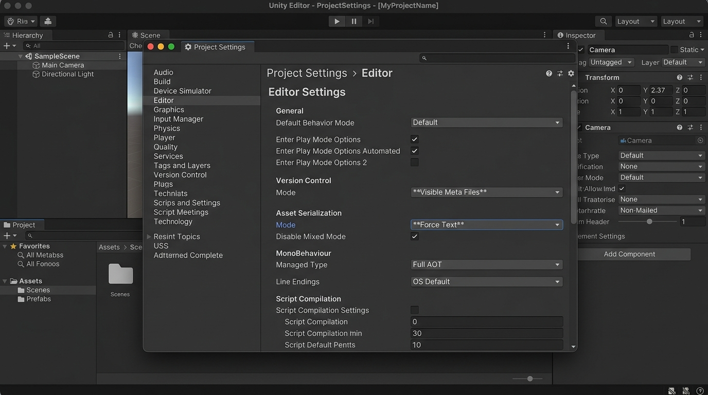
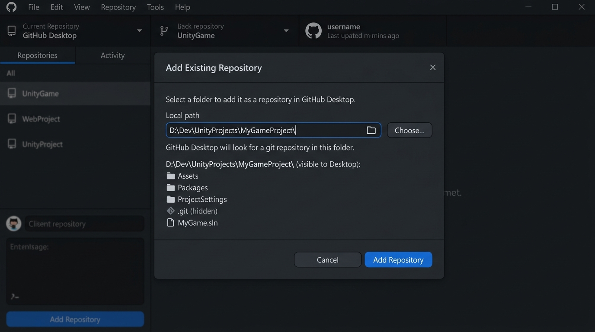
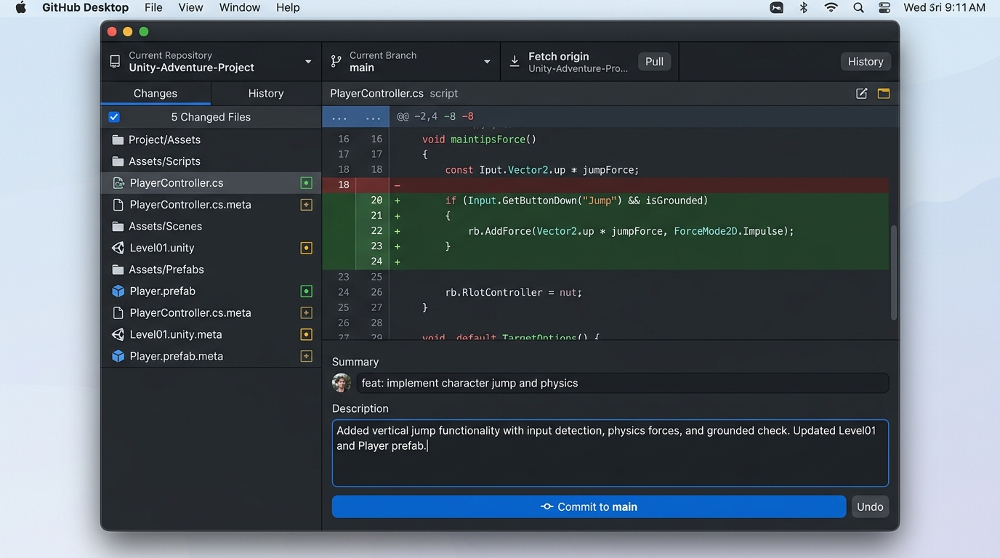
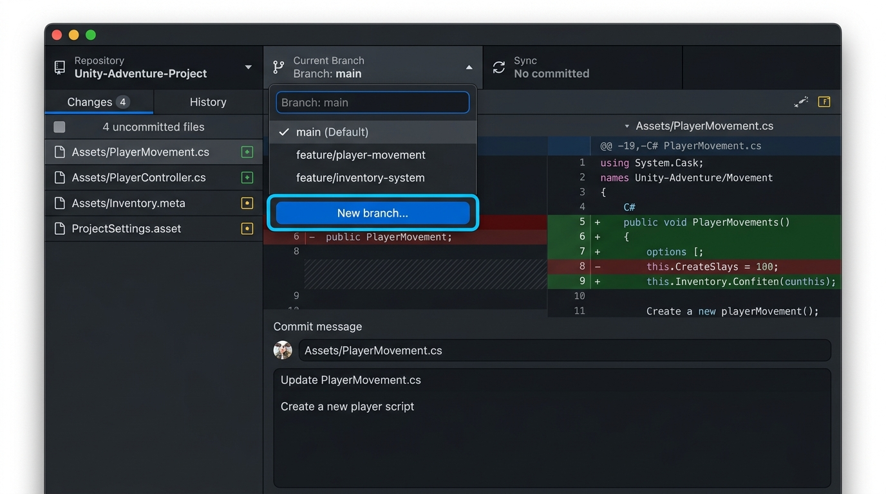
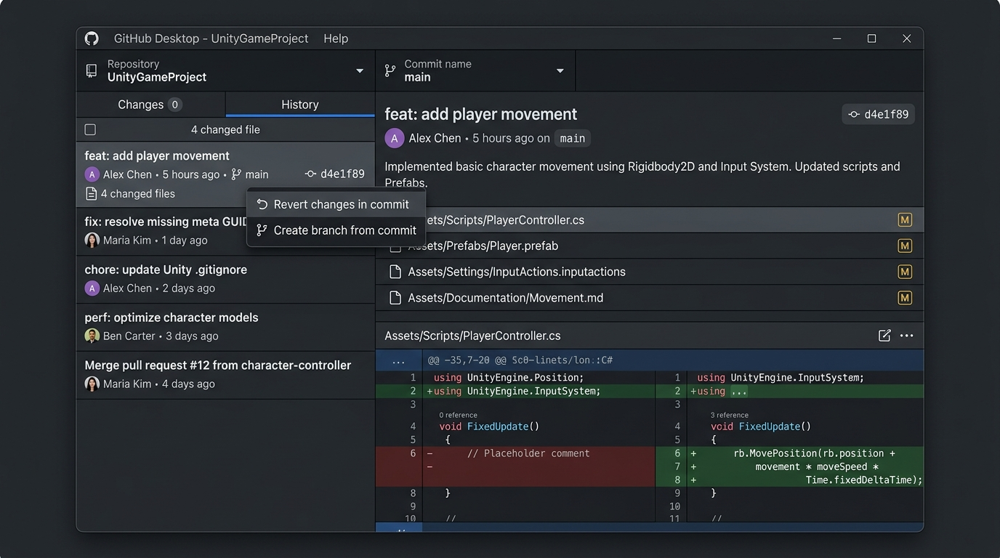
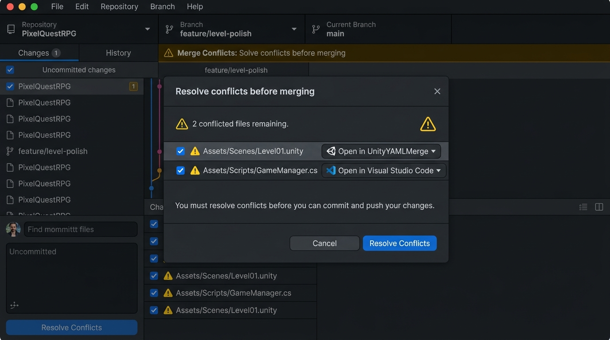

# Manual de Unity y GitHub: De Novato a Avanzado en Debian Linux

> **Plataforma:** Debian GNU/Linux (11 Bullseye / 12 Bookworm / Ubuntu LTS / Derivadas)  
> **Motor:** Unity 2022 LTS / Unity 6 (6000.x)  
> **Herramientas:** Git 2.40+, Git LFS, GitHub CLI (`gh`), GitHub Desktop (Linux Fork / Flatpak), Unity Hub, UnityYAMLMerge  

---

## Índice de Contenidos

1. [Parte I: Fundamentos y Preparación del Entorno Unity en Debian](#parte-i-fundamentos-y-preparación-del-entorno-unity-en-debian)
   - 1.1 [Anatomía de un Proyecto de Unity: Qué se versiona y qué se ignora](#11-anatomía-de-un-proyecto-de-unity-qué-se-versiona-y-qué-se-ignora)
   - 1.2 [Instalación de Git, Git LFS, GitHub CLI y GitHub Desktop en Debian](#12-instalación-de-git-git-lfs-github-cli-y-github-desktop-en-debian)
   - 1.3 [Configuración Crítica del Editor: Visible Meta Files y Force Text](#13-configuración-crítica-del-editor-visible-meta-files-y-force-text)
   - 1.4 [La Regla de Oro de los Archivos `.meta` y los GUIDs](#14-la-regla-de-oro-de-los-archivos-meta-y-los-guids)
   - 1.5 [El Archivo `.gitignore` Oficial y Optimizado para Unity](#15-el-archivo-gitignore-oficial-y-optimizado-para-unity)
   - 1.6 [Configuración Exhaustiva de Git LFS con `.gitattributes`](#16-configuración-exhaustiva-de-git-lfs-con-gitattributes)
   - 1.7 [Arquitectura de Proyectos AAA: Separación de Assets Propios (`_Project/`) vs Plugins](#17-arquitectura-de-proyectos-aaa-separación-de-assets-propios-_project-vs-plugins)
2. [Parte II: Flujo de Trabajo Esencial Diario (Nivel Novato)](#parte-ii-flujo-de-trabajo-esencial-diario-nivel-novato)
   - 2.1 [Inicializar y Publicar un Proyecto en GitHub (Terminal y GitHub Desktop)](#21-inicializar-y-publicar-un-proyecto-en-github-terminal-y-github-desktop)
   - 2.2 [Clonación Correcta de Proyectos con Git LFS](#22-clonación-correcta-de-proyectos-con-git-lfs)
   - 2.3 [El Ciclo de Trabajo Seguro: Modificar, Inspeccionar y Confirmar Commits](#23-el-ciclo-de-trabajo-seguro-modificar-inspeccionar-y-confirmar-commits)
   - 2.4 [Conventional Commits Aplicados al Desarrollo de Videojuegos](#24-conventional-commits-aplicados-al-desarrollo-de-videojuegos)
   - 2.5 [Sincronización sin Romper la Cache (`pull --rebase` vs Fetch en Desktop)](#25-sincronización-sin-romper-la-cache-pull---rebase-vs-fetch-en-desktop)
3. [Parte III: Ramas, Fusiones y Estrategias Colaborativas (Nivel Intermedio)](#parte-iii-ramas-fusiones-y-estrategias-colaborativas-nivel-intermedio)
   - 3.1 [Estrategia de Ramas en Equipos de Videojuegos (CLI y Desktop)](#31-estrategia-de-ramas-en-equipos-de-videojuegos-cli-y-desktop)
   - 3.2 [Arquitectura de Escenas Divididas (Multi-Scene Editing Aditivo)](#32-arquitectura-de-escenas-divididas-multi-scene-editing-aditivo)
   - 3.3 [Aislamiento de Trabajo Mediante Prefabs Anidados y Variantes](#33-aislamiento-de-trabajo-mediante-prefabs-anidados-y-variantes)
   - 3.4 [Configuración de UnityYAMLMerge y Personalización de Fallback en `mergespecfile.txt`](#34-configuración-de-unityyamlmerge-y-personalización-de-fallback-en-mergespecfiletxt)
   - 3.5 [Uso de Git Stash, Historial y Reversión Segura (CLI y Desktop)](#35-uso-de-git-stash-historial-y-reversión-segura-cli-y-desktop)
   - 3.6 [Modularización de Código con Assembly Definitions (`.asmdef` y `.asmref`)](#36-modularización-de-código-con-assembly-definitions-asmdef-y-asmref)
   - 3.7 [Unity Accelerator: Aceleración de Descargas y Caché de Importación en LAN](#37-unity-accelerator-aceleración-de-descargas-y-caché-de-importación-en-lan)
4. [Parte IV: Soluciones por Temas a Conflictos y Edición Concurrente](#parte-iv-soluciones-por-temas-a-conflictos-y-edición-concurrente)
   - 4.1 [Tema 1: Prevención Arquitectónica de Conflictos en Unity](#41-tema-1-prevención-arquitectónica-de-conflictos-en-unity)
   - 4.2 [Tema 2: Conflictos en Archivos `.meta` (GUID Desincronizado)](#42-tema-2-conflictos-en-archivos-meta-guid-desincronizado)
   - 4.3 [Tema 3: Conflictos en Scripts C# (`.cs`)](#43-tema-3-conflictos-en-scripts-c-cs)
   - 4.4 [Tema 4: Conflictos en Escenas y Prefabs con UnityYAMLMerge (CLI y Desktop)](#44-tema-4-conflictos-en-escenas-y-prefabs-con-unityyamlmerge-cli-y-desktop)
   - 4.5 [Tema 5: Forzar una Versión Completa de Asset (`--ours` vs `--theirs`)](#45-tema-5-forzar-una-versión-completa-de-asset---ours-vs---theirs)
   - 4.6 [Tema 6: Cambios Locales en el Editor al Hacer Pull](#46-tema-6-cambios-locales-en-el-editor-al-hacer-pull)
   - 4.7 [Tema 7: Push Rechazado por Desfase y Rebase Seguro con LFS](#47-tema-7-push-rechazado-por-desfase-y-rebase-seguro-con-lfs)
   - 4.8 [Tema 8: Conflictos en Binarios y Bloqueo con Git LFS Lock](#48-tema-8-conflictos-en-binarios-y-bloqueo-con-git-lfs-lock)
   - 4.9 [Tema 9: Conflicto de Eliminación de Asset con `.meta` Huérfano](#49-tema-9-conflicto-de-eliminación-de-asset-con-meta-huérfano)
5. [Parte V: Herramientas Modernas de Productividad Avanzada](#parte-v-herramientas-modernas-de-productividad-avanzada)
   - 5.1 [Git Worktrees en Linux: Trabajar en Múltiples Ramas sin Recargar `Library/`](#51-git-worktrees-en-linux-trabajar-en-múltiples-ramas-sin-recargar-library)
   - 5.2 [Depuración Binaria con Git Bisect y Blame en C#](#52-depuración-binaria-con-git-bisect-y-blame-en-c)
   - 5.3 [GitHub Codespaces y Desarrollo en la Nube para Unity](#53-github-codespaces-y-desarrollo-en-la-nube-para-unity)
   - 5.4 [GitHub Copilot CLI para Programadores de Unity](#54-github-copilot-cli-para-programadores-de-unity)
   - 5.5 [Git Hooks y Validación Pre-commit de Archivos `.meta`](#55-git-hooks-y-validación-pre-commit-de-archivos-meta)
   - 5.6 [Descargas Parciales y Ahorro de Cuota de Git LFS con `lfs.fetchexclude` y `git sparse-checkout`](#56-descargas-parciales-y-ahorro-de-cuota-de-git-lfs-con-lfsfetchexclude-y-git-sparse-checkout)
6. [Parte VI: Gestión de Paquetes UPM y Dependencias](#parte-vi-gestión-de-paquetes-upm-y-dependencias)
   - 6.1 [Instalación de Paquetes Mediante URLs de Git en UPM](#61-instalación-de-paquetes-mediante-urls-de-git-en-upm)
   - 6.2 [Creación y Publicación de Paquetes UPM en Repositorios Privados con Tokens](#62-creación-y-publicación-de-paquetes-upm-en-repositorios-privados-con-tokens)
   - 6.3 [Addressables Asset System frente a `Resources/`: Versionado y Despliegue en CDN](#63-addressables-asset-system-frente-a-resources-versionado-y-despliegue-en-cdn)
7. [Parte VII: Automatización CI/CD con GitHub Actions y GameCI](#parte-vii-automatización-cicd-con-github-actions-y-gameci)
   - 7.1 [Arquitectura de GameCI para Compilaciones de Videojuegos](#71-arquitectura-de-gameci-para-compilaciones-de-videojuegos)
   - 7.2 [Activación de Licencias de Unity en GitHub Actions](#72-activación-de-licencias-de-unity-en-github-actions)
   - 7.3 [Pipeline Automatizado: Tests EditMode/PlayMode y Compilación StandaloneLinux64](#73-pipeline-automatizado-tests-editmodeplaymode-y-compilación-standalonelinux64)
   - 7.4 [Subida Automática de Artefactos de Build](#74-subida-automática-de-artefactos-de-build)
   - 7.5 [Pruebas Automatizadas con Code Coverage y Reportes en GitHub Actions](#75-pruebas-automatizadas-con-code-coverage-y-reportes-en-github-actions)
8. [Parte VIII: Seguridad y Políticas de Repositorio en Equipos de Videojuegos](#parte-viii-seguridad-y-políticas-de-repositorio-en-equipos-de-videojuegos)
   - 8.1 [Protección de Ramas y Rulesets](#81-protección-de-ramas-y-rulesets)
   - 8.2 [Gestión de Secretos para APIs de Juegos (Steam, Photon, Firebase)](#82-gestión-de-secretos-para-apis-de-juegos-steam-photon-firebase)
   - 8.3 [Gobernanza con `CODEOWNERS` para Artistas y Programadores](#83-gobernanza-con-codeowners-para-artistas-y-programadores)
9. [Parte IX: Distribución y Despliegue con GitHub Releases](#parte-ix-distribución-y-despliegue-con-github-releases)
   - 9.1 [Creación Automatizada de Releases con Tags Semánticos](#91-creación-automatizada-de-releases-con-tags-semánticos)
   - 9.2 [Publicación de Instaladores y Paquetes de Videojuegos](#92-publicación-de-instaladores-y-paquetes-de-videojuegos)
10. [Parte X: Catálogo Maestro de Incidentes Críticos de Unity en Linux](#parte-x-catálogo-maestro-de-incidentes-críticos-de-unity-en-linux)
    - 10.1 [Incidente 1: "Missing Script" Masivo por Desincronización de GUIDs](#101-incidente-1-missing-script-masivo-por-desincronización-de-guids)
    - 10.2 [Incidente 2: Escena Corrupta por Edición Manual o Conflicto Mal Resuelto](#102-incidente-2-escena-corrupta-por-edición-manual-o-conflicto-mal-resuelto)
    - 10.3 [Incidente 3: Subida Accidental de la Carpeta `Library/` (Repositorio Gigante)](#103-incidente-3-subida-accidental-de-la-carpeta-library-repositorio-gigante)
    - 10.4 [Incidente 4: Repositorio Bloqueado por Superar el Límite de 100 MB](#104-incidente-4-repositorio-bloqueado-por-superar-el-límite-de-100-mb)
    - 10.5 [Incidente 5: Shaders Magenta / Rosados tras Clonar en Linux](#105-incidente-5-shaders-magenta--rosados-tras-clonar-en-linux)
    - 10.6 [Incidente 6: Límite de Almacenamiento y Ancho de Banda de Git LFS Superado](#106-incidente-6-límite-de-almacenamiento-y-ancho-de-banda-de-git-lfs-superado)
    - 10.7 [Incidente 7: Desfase de Versiones Menores del Editor de Unity](#107-incidente-7-desfase-de-versiones-menores-del-editor-de-unity)
    - 10.8 [Incidente 8: Archivos Bloqueados por Procesos de Unity en Ejecución](#108-incidente-8-archivos-bloqueados-por-procesos-de-unity-en-ejecución)
    - 10.9 [Incidente 9: Fuga de Claves Privadas en ScriptableObjects o Configuración](#109-incidente-9-fuga-de-claves-privadas-en-scriptableobjects-o-configuración)
    - 10.10 [Incidente 10: Regeneración Limpia y Segura de la Caché Local del Proyecto](#1010-incidente-10-regeneración-limpia-y-segura-de-la-caché-local-del-proyecto)

---

# Parte I: Fundamentos y Preparación del Entorno Unity en Debian

## 1.1 Anatomía de un Proyecto de Unity: Qué se versiona y qué se ignora

Un proyecto de Unity contiene miles de archivos autogenerados. Comprender la estructura de carpetas es vital para no saturar tu repositorio ni corromper el motor:

```
MiJuegoUnity/
├── Assets/              --> [OBLIGATORIO EN GIT] Código C#, Escenas, Prefabs, Texturas, Modelos y sus archivos .meta.
├── Packages/            --> [OBLIGATORIO EN GIT] manifest.json y packages-lock.json (librerías UPM).
├── ProjectSettings/     --> [OBLIGATORIO EN GIT] Configuración física, capas, tags, gráficos del juego.
├── Library/             --> [¡NUNCA EN GIT!] Cache compilada de assets generada por el Editor local.
├── Temp/                --> [¡NUNCA EN GIT!] Archivos temporales de ejecución y compilación.
├── Obj/ & Build/        --> [¡NUNCA EN GIT!] Binarios compilados y ejecutables de prueba.
├── UserSettings/        --> [¡NUNCA EN GIT!] Distribución de ventanas y preferencias del usuario local.
└── Logs/                --> [¡NUNCA EN GIT!] Registros de compilación y fallos del editor.
```

<div class="back-to-index"><a href="#índice-de-contenidos">↑ Volver al Índice de Contenidos</a></div>

---

## 1.2 Instalación de Git, Git LFS, GitHub CLI y GitHub Desktop en Debian

En Debian Linux, los proyectos de videojuegos requieren Git LFS (Large File Storage) para alojar archivos pesados (texturas 4K, audios sin compresión y modelos 3D), GitHub CLI para automatización y GitHub Desktop para artistas y diseñadores que prefieren entorno gráfico.

### Paso 1: Instalar dependencias del sistema y Git LFS
```bash
sudo apt update && sudo apt install -y curl wget git git-lfs gnupg build-essential
git lfs install
```
> **¿Qué hace este comando?**  
> Actualiza los paquetes de Debian, instala Git y el soporte nativo de **Git LFS**, e inicializa los filtros de compresión y punteros (`clean`, `smudge` y `filter`) en la configuración global de tu usuario.

### Paso 2: Instalar GitHub CLI (`gh`)
```bash
sudo mkdir -p -m 755 /etc/apt/keyrings
wget -qO- https://cli.github.com/packages/githubcli-archive-keyring.gpg | sudo tee /etc/apt/keyrings/githubcli-archive-keyring.gpg > /dev/null
sudo chmod go+r /etc/apt/keyrings/githubcli-archive-keyring.gpg
echo "deb [arch=$(dpkg --print-architecture) signed-by=/etc/apt/keyrings/githubcli-archive-keyring.gpg] https://cli.github.com/packages stable main" | sudo tee /etc/apt/sources.list.d/github-cli.list > /dev/null
sudo apt update && sudo apt install -y gh
```
> **¿Qué hace este comando?**  
> Registra la clave criptográfica oficial de GitHub, añade el repositorio oficial a Debian e instala la herramienta oficial de línea de comandos `gh`.

### Paso 3: Instalar GitHub Desktop en Debian Linux
GitHub Desktop en Linux se instala fácilmente a través del repositorio empaquetado por la comunidad o mediante Flatpak:

```bash
# Opción A: Mediante repositorio APT (Recomendado para Debian/Ubuntu)
wget -qO - https://mirror.mwt.me/ghd/gpgkey | sudo tee /etc/apt/keyrings/mwt.asc > /dev/null
echo "deb [arch=amd64 signed-by=/etc/apt/keyrings/mwt.asc] https://mirror.mwt.me/ghd/deb/ any main" | sudo tee /etc/apt/sources.list.d/github-desktop.list
sudo apt update && sudo apt install -y github-desktop

# Opción B: Mediante Flatpak
flatpak install -y flathub io.github.shifteight.GitHubDesktop
```
> **¿Qué hace este comando?**  
> Proporciona la aplicación nativa gráfica de GitHub Desktop en tu escritorio GNOME, KDE o XFCE de Debian, permitiendo flujos visuales completos para los miembros no técnicos del equipo.

<div class="back-to-index"><a href="#índice-de-contenidos">↑ Volver al Índice de Contenidos</a></div>

---

## 1.3 Configuración Crítica del Editor: Visible Meta Files y Force Text

Antes de inicializar Git en cualquier proyecto de Unity, debes verificar dos ajustes obligatorios en el Editor:

1. Abre tu proyecto en Unity en Debian.
2. Navega a **Edit -> Project Settings -> Version Control**.
   - En **Mode**, selecciona estrictamente: `Visible Meta Files`.
3. Navega a **Edit -> Project Settings -> Editor**.
   - En **Asset Serialization Mode**, selecciona estrictamente: `Force Text`.


<span class="caption-text">Figura 1.1: Configuración obligatoria en Unity Project Settings (Editor) estableciendo Visible Meta Files y Force Text para serialización YAML.</span>

> [!IMPORTANT]
> `Force Text` obliga a Unity a guardar todas las escenas (`.unity`), prefabs (`.prefab`), materiales (`.mat`) y configuraciones en texto plano **YAML** en lugar de binario propietario. Esto permite ver diferencias (*diffs*) comprensibles y fusionar cambios en Git.

<div class="back-to-index"><a href="#índice-de-contenidos">↑ Volver al Índice de Contenidos</a></div>

---

## 1.4 La Regla de Oro de los Archivos `.meta` y los GUIDs

Por cada archivo y carpeta dentro de `Assets/`, Unity crea un archivo gemelo con extensión `.meta`:
* `Heroe.cs` -> `Heroe.cs.meta`
* `Texturas/` -> `Texturas.meta`

Dentro de cada `.meta` hay un identificador único global llamado **GUID**:
```yaml
fileFormatVersion: 2
guid: e81b8979d46f4eb2a6886e92f25b2901
```

> [!CAUTION]
> **LA REGLA FUNDAMENTAL DE UNITY Y GIT:**  
> 1. Si mueves o renombras un archivo fuera de Unity (por ejemplo en la terminal), **DEBES mover o renombrar su `.meta` idénticamente**.
> 2. Si eliminas un asset, **DEBES eliminar su archivo `.meta`**.
> 3. Al hacer commit, **NUNCA hagas commit de un asset sin su archivo `.meta` acompañante**. Si rompes esta regla, los componentes aparecerán en las escenas como **"Missing (Script)"** o los materiales perderán sus texturas.

<div class="back-to-index"><a href="#índice-de-contenidos">↑ Volver al Índice de Contenidos</a></div>

---

## 1.5 El Archivo `.gitignore` Oficial y Optimizado para Unity

Crea este archivo `.gitignore` en la raíz de tu repositorio para asegurar que solo los archivos fuente sean rastreados:

```gitignore
# ==========================================
# Archivo Oficial .gitignore para Unity
# ==========================================

[Ll]ibrary/
[Tt]emp/
[Oo]bj/
[Bb]uild/
[Bb]uilds/
[Ll]ogs/
[Uu]ser[Ss]ettings/
[Mm]emoryCaptures/

# Asset server cache
sysinfo.txt
*.stackdump

# Configuraciones y soluciones generadas por IDEs
.vs/
.idea/
*.csproj
*.unityproj
*.sln
*.suo
*.user
*.userprefs
*.pidb
*.booproj
*.svd
*.pdb
*.opendb
*.VC.db

# Compilaciones de Unity Standalone y WebGL
*.apk
*.aab
*.unitypackage
*.app
*.x86_64
*.debug

# Sistema Operativo Linux
.directory
*~
.fuse_hidden*
.Trash-*
.nfs*
.DS_Store
Thumbs.db
```

<div class="back-to-index"><a href="#índice-de-contenidos">↑ Volver al Índice de Contenidos</a></div>

---

## 1.6 Configuración Exhaustiva de Git LFS con `.gitattributes`

Crea el archivo `.gitattributes` en la raíz del proyecto para indicarle a Git qué archivos deben gestionarse a través del almacenamiento de grandes objetos (LFS) y cuáles son texto fusionable:

```gitattributes
# ==========================================
# Configuración de Git LFS para Unity en Linux
# ==========================================

# Modelos 3D y Formatos de Animación
*.fbx filter=lfs diff=lfs merge=lfs -text
*.obj filter=lfs diff=lfs merge=lfs -text
*.blend filter=lfs diff=lfs merge=lfs -text
*.dae filter=lfs diff=lfs merge=lfs -text
*.3ds filter=lfs diff=lfs merge=lfs -text
*.max filter=lfs diff=lfs merge=lfs -text

# Texturas e Imágenes de Alta Resolución
*.psd filter=lfs diff=lfs merge=lfs -text
*.tga filter=lfs diff=lfs merge=lfs -text
*.png filter=lfs diff=lfs merge=lfs -text
*.jpg filter=lfs diff=lfs merge=lfs -text
*.jpeg filter=lfs diff=lfs merge=lfs -text
*.exr filter=lfs diff=lfs merge=lfs -text
*.hdr filter=lfs diff=lfs merge=lfs -text
*.tif filter=lfs diff=lfs merge=lfs -text
*.tiff filter=lfs diff=lfs merge=lfs -text

# Audio y Efectos Sonoros
*.wav filter=lfs diff=lfs merge=lfs -text
*.mp3 filter=lfs diff=lfs merge=lfs -text
*.ogg filter=lfs diff=lfs merge=lfs -text
*.aif filter=lfs diff=lfs merge=lfs -text
*.aiff filter=lfs diff=lfs merge=lfs -text

# Vídeo y Cutscenes
*.mp4 filter=lfs diff=lfs merge=lfs -text
*.mov filter=lfs diff=lfs merge=lfs -text
*.webm filter=lfs diff=lfs merge=lfs -text

# Paquetes Comprimidos y Tipografías
*.zip filter=lfs diff=lfs merge=lfs -text
*.7z filter=lfs diff=lfs merge=lfs -text
*.tar.gz filter=lfs diff=lfs merge=lfs -text
*.otf filter=lfs diff=lfs merge=lfs -text
*.ttf filter=lfs diff=lfs merge=lfs -text

# Activar Bloqueo Concurrente (LFS Lock) para Binarios Críticos
*.fbx lockable
*.psd lockable
*.blend lockable
*.wav lockable

# Serialización de Texto y Mergetool de Unity
*.cs text diff=csharp eol=lf
*.json text eol=lf
*.shader text eol=lf
*.unity merge=unityyamlmerge eol=lf
*.prefab merge=unityyamlmerge eol=lf
*.mat merge=unityyamlmerge eol=lf
*.asset merge=unityyamlmerge eol=lf
*.meta text eol=lf
```

<div class="back-to-index"><a href="#índice-de-contenidos">↑ Volver al Índice de Contenidos</a></div>

---

## 1.7 Arquitectura de Proyectos AAA: Separación de Assets Propios (`_Project/`) vs Plugins

En estudios profesionales de desarrollo de videojuegos, colocar assets en la raíz de `Assets/` es una práctica desaconsejada. Cuando importas paquetes de la Asset Store de Unity, sus carpetas se mezclan con tu código fuente, ensuciando los diffs de Git y provocando colisiones accidentales de `.meta`.

### Patrón Recomendado: La Carpeta Raíz de Proyecto
Crea una carpeta raíz con guion bajo (para que aparezca primera en el explorador de Unity):

```
Assets/
├── _Project/                --> [CÓDIGO Y ASSETS PROPIOS DEL ESTUDIO]
│   ├── Art/                 --> Modelos 3D, Texturas, Materiales propios
│   ├── Audio/               --> Música y efectos SFX
│   ├── Core/                --> GameManagers, Singletons, Arquitectura
│   ├── Gameplay/            --> Mecánicas, Jugador, Enemigos
│   ├── Prefabs/             --> Entidades modulares del juego
│   ├── Scenes/              --> Escenas aditivas
│   └── UI/                  --> Menús, fuentes y HUD
├── Plugins/                 --> SDKs externos que requieren ubicación fija
└── ThirdParty/              --> Assets descargados de la Asset Store (solo lectura)
```

> [!TIP]
> Al mantener todo tu trabajo en `Assets/_Project/`, puedes configurar reglas de `CODEOWNERS` y permisos de Git con gran sencillez, y actualizar o borrar paquetes de terceros en `ThirdParty/` sin temor a afectar tus propios scripts y escenas.

<div class="back-to-index"><a href="#índice-de-contenidos">↑ Volver al Índice de Contenidos</a></div>

---

# Parte II: Flujo de Trabajo Esencial Diario (Nivel Novato)

## 2.1 Inicializar y Publicar un Proyecto en GitHub (Terminal y GitHub Desktop)

### Modalidad A: Vía Terminal de Linux (Bash)
```bash
cd ~/UnityProjects/MiVideojuego
git init
git lfs install
git add .gitattributes .gitignore
git commit -m "chore: inicializar configuración de Unity con LFS y gitignore"
git branch -M main
gh repo create MiVideojuego --private --source=. --remote=origin --push
```
> **¿Qué hace este comando?**  
> Inicializa el repositorio Git local, activa Git LFS, agrega la configuración inicial de filtros, renombra la rama principal a `main` y utiliza la herramienta `gh` para crear el repositorio privado directamente en GitHub y subir los archivos.

### Modalidad B: Vía GitHub Desktop (Entorno Gráfico)
1. Abre **GitHub Desktop** desde el lanzador de aplicaciones de Debian.
2. Pulsa en el menú superior **File -> Add Local Repository** (o `Ctrl + O`).
3. Selecciona la carpeta de tu juego (donde están `Assets`, `Packages` y `ProjectSettings`).
4. Si la carpeta aún no tiene Git, pulsa en el enlace azul **"create a repository"**.
5. Asegúrate de seleccionar el Git Ignore para **Unity** y la licencia adecuada.
6. Pulsa en el botón azul **"Publish Repository"** en la barra superior para subirlo a tu cuenta de GitHub con visibilidad pública o privada.


<span class="caption-text">Figura 2.1: Cuadro de diálogo 'Add Existing Repository' en GitHub Desktop seleccionando la carpeta del proyecto Unity.</span>

<div class="back-to-index"><a href="#índice-de-contenidos">↑ Volver al Índice de Contenidos</a></div>

---

## 2.2 Clonación Correcta de Proyectos con Git LFS

Al clonar un proyecto de Unity en otra estación de trabajo Linux, debes asegurarte de que los archivos pesados de Git LFS se descarguen correctamente:

### Modalidad A: Vía Terminal
```bash
git lfs install
git clone git@github.com:mi-organizacion/videojuego.git
cd videojuego
git lfs pull
```
> **¿Qué hace este comando?**  
> Asegura que el filtro LFS esté activo en el sistema, clona el repositorio de GitHub y fuerza la descarga completa (`git lfs pull`) de todos los archivos binarios referenciados por punteros.

### Modalidad B: Vía GitHub Desktop
1. Pulsa en **File -> Clone Repository** (o `Ctrl + Shift + O`).
2. En la pestaña **GitHub.com**, busca el repositorio del juego o pega la URL en la pestaña **URL**.
3. Elige la ruta local de destino en tu disco y pulsa **Clone**.
4. GitHub Desktop detecta automáticamente Git LFS y descargará los modelos 3D y texturas sin requerir comandos adicionales.

<div class="back-to-index"><a href="#índice-de-contenidos">↑ Volver al Índice de Contenidos</a></div>

---

## 2.3 El Ciclo de Trabajo Seguro: Modificar, Inspeccionar y Confirmar Commits

El ciclo en Unity exige revisar que cada asset modificado vaya acompañado de su respectivo archivo `.meta`.

### Modalidad A: Vía Terminal
```bash
# 1. Inspeccionar el estado de los archivos
git status

# 2. Agregar cambios asegurando que archivos y sus .meta vayan juntos
git add Assets/_Project/Scripts/PlayerController.cs Assets/_Project/Scripts/PlayerController.cs.meta
git add Assets/_Project/Prefabs/Player.prefab Assets/_Project/Prefabs/Player.prefab.meta

# 3. Confirmar cambios con mensaje descriptivo
git commit -m "feat(player): añadir salto e impulso de física con Rigidbody2D"
```
> **¿Qué hace este comando?**  
> Muestra los archivos modificados, añade selectivamente el script y el prefab junto a sus respectivos archivos de metadatos `.meta`, y crea un commit atómico.

### Modalidad B: Vía GitHub Desktop
1. En la columna izquierda de **Changes**, verás la lista de archivos modificados.
2. Comprueba que por cada archivo `.cs`, `.prefab` o `.unity`, su correspondiente `.meta` esté marcado con la casilla de verificación activada.
3. En el panel derecho puedes inspeccionar la diferencia exacta (*diff*) de las líneas añadidas o eliminadas.
4. En el recuadro inferior izquierdo, escribe el **Summary** (título del commit) y opcionalmente una **Description**.
5. Haz clic en el botón azul **Commit to main** (o a la rama en la que te encuentres).


<span class="caption-text">Figura 2.2: Interfaz de GitHub Desktop mostrando la verificación en pareja de scripts y sus archivos .meta antes de confirmar el commit.</span>

<div class="back-to-index"><a href="#índice-de-contenidos">↑ Volver al Índice de Contenidos</a></div>

---

## 2.4 Conventional Commits Aplicados al Desarrollo de Videojuegos

Usa prefijos estandarizados para que el historial sea comprensible por programadores, artistas y diseñadores:

| Prefijo | Área de Aplicación en Videojuegos | Ejemplo |
| :--- | :--- | :--- |
| `feat:` | Nueva mecánica, sistema o lógica de juego | `feat(combat): implementar combo de 3 golpes con espada` |
| `fix:` | Corrección de bugs de código o físicas | `fix(physics): evitar que el personaje atraviese esquinas a alta velocidad` |
| `art:` | Nuevos modelos 3D, texturas, sprites o rigs | `art(enemies): añadir textura difusa 4K y normal map del boss` |
| `level:` | Modificaciones en escenas, iluminación o props | `level(dungeon): colocar cofres de recompensa y luces en sala 2` |
| `audio:` | Efectos de sonido, música de fondo y mixers | `audio(ui): integrar sonido de clic y confirmación de compra` |
| `perf:` | Optimización de draw calls, LODs o GC Alloc | `perf(rendering): reducir uso de memoria mediante Texture Compression ASTC` |
| `chore:` | Actualización de dependencias UPM o gitignore | `chore(deps): actualizar Cinemachine a version 2.9.7` |

<div class="back-to-index"><a href="#índice-de-contenidos">↑ Volver al Índice de Contenidos</a></div>

---

## 2.5 Sincronización sin Romper la Cache (`pull --rebase` vs Fetch en Desktop)

En Unity, hacer un `pull` con merge commits innecesarios provoca cambios constantes de timestamp que fuerzan al Editor a reimportar innecesariamente la base de datos de assets.

### Modalidad A: Vía Terminal
```bash
git pull --rebase origin main
git push origin main
```
> **¿Qué hace este comando?**  
> Descarga los commits del servidor remoto y recoloca tus commits locales ordenadamente por encima sin crear un commit de fusión falso, evitando reinicios masivos del importador de Unity.

### Modalidad B: Vía GitHub Desktop
1. En la barra superior, haz clic en **Fetch origin** para comprobar si hay actualizaciones en el servidor.
2. Si existen cambios nuevos, el botón cambiará a **Pull origin** con un contador.
3. Haz clic en **Pull origin** para recibir los cambios.
4. Finalmente, haz clic en **Push origin** para enviar tus commits a GitHub.

<div class="back-to-index"><a href="#índice-de-contenidos">↑ Volver al Índice de Contenidos</a></div>

---

# Parte III: Ramas, Fusiones y Estrategias Colaborativas (Nivel Intermedio)

## 3.1 Estrategia de Ramas en Equipos de Videojuegos (CLI y Desktop)

En proyectos de videojuegos, las ramas evitan que experimentos rotos desestabilicen el proyecto principal:
* `main`: Versión estable, siempre jugable y sin errores de compilación.
* `develop`: Integración de mecánicas completadas.
* `feature/<nombre>`: Desarrollo de sistemas específicos (`feature/inventario`).
* `art/<nombre>`: Incorporación y ajuste estético de modelos y animaciones.

### Modalidad A: Vía Terminal
```bash
# Crear y cambiar a una rama de funcionalidad
git switch -c feature/sistema-inventario

# Subir la rama a GitHub
git push -u origin feature/sistema-inventario
```
> **¿Qué hace este comando?**  
> Crea la nueva rama aislada y la publica en GitHub vinculándola para futuros pushes automáticos.

### Modalidad B: Vía GitHub Desktop
1. En la barra superior, haz clic en el menú desplegable **Current Branch**.
2. Escribe el nombre de la nueva rama (por ejemplo `feature/sistema-inventario`).
3. Haz clic en el botón azul **New branch...**.
4. Haz clic en **Publish branch** para sincronizarla con el repositorio remoto de GitHub.


<span class="caption-text">Figura 3.1: Menú desplegable 'Current Branch' en GitHub Desktop para creación y conmutación de ramas de trabajo.</span>

<div class="back-to-index"><a href="#índice-de-contenidos">↑ Volver al Índice de Contenidos</a></div>

---

## 3.2 Arquitectura de Escenas Divididas (Multi-Scene Editing Aditivo)

El error más destructivo en un equipo de Unity es tener a dos personas editando el mismo archivo `Nivel01.unity` simultáneamente. La solución técnica profesional es la **Carga Aditiva de Escenas**:

```
Nivel01 (Estructura de Escenas):
├── Nivel01_Core.unity        --> Cámaras principales, GameManagers, UI Canvas.
├── Nivel01_Geometry.unity    --> Terreno, mallas estáticas, colisionadores (Artistas).
├── Nivel01_Lighting.unity    --> Luces, Reflection Probes, Lightmaps (Iluminadores).
└── Nivel01_Gameplay.unity    --> Spawners de enemigos, triggers, checkpoints (Diseñadores).
```

### Script C# para Carga Aditiva en Tiempo de Ejecución:
Guarda este script en `Assets/_Project/Scripts/SceneLoader.cs`:
```csharp
using UnityEngine;
using UnityEngine.SceneManagement;

public class SceneLoader : MonoBehaviour
{
    [Header("Escenas Aditivas")]
    [SerializeField] private string[] additiveScenes = {
        "Nivel01_Geometry",
        "Nivel01_Lighting",
        "Nivel01_Gameplay"
    };

    private void Start()
    {
        foreach (string sceneName in additiveScenes)
        {
            if (!SceneManager.GetSceneByName(sceneName).isLoaded)
            {
                SceneManager.LoadSceneAsync(sceneName, LoadSceneMode.Additive);
            }
        }
    }
}
```
> **Beneficio en Git:**  
> El artista trabaja en `Nivel01_Geometry.unity`, el iluminador en `Nivel01_Lighting.unity` y el programador en `Nivel01_Core.unity`. Cada persona modifica un archivo físico diferente, logrando **cero conflictos de fusión**.

<div class="back-to-index"><a href="#índice-de-contenidos">↑ Volver al Índice de Contenidos</a></div>

---

## 3.3 Aislamiento de Trabajo Mediante Prefabs Anidados y Variantes

Las escenas deben contener únicamente instancias de Prefabs, no GameObjects crudos sueltos:

1. **Evita la modificación directa en la jerarquía de la escena:** Si necesitas alterar el comportamiento o los componentes de un enemigo, abre su archivo `.prefab` en el **Prefab Mode**.
2. **Usa Variantes de Prefab:** Crea un prefab base `EnemigoBase.prefab` y genera variantes como `EnemigoFuego.prefab` y `EnemigoHielo.prefab`. Las variaciones sólo guardan las diferencias (*overrides*), manteniendo los diffs de Git limpios y atómicos.

<div class="back-to-index"><a href="#índice-de-contenidos">↑ Volver al Índice de Contenidos</a></div>

---

## 3.4 Configuración de UnityYAMLMerge y Personalización de Fallback en `mergespecfile.txt`

UnityYAMLMerge es la herramienta tridireccional nativa de Unity diseñada para interpretar la estructura abstracta de árbol (AST) de escenas y prefabs YAML.

### Configuración del Driver de Fusión en Git
```bash
# Configuración global de UnityYAMLMerge en Debian Linux
git config --global merge.unityyamlmerge.name "Unity Smart Merge"
git config --global merge.unityyamlmerge.driver \
  "~/Unity/Hub/Editor/$(ls -1 ~/Unity/Hub/Editor 2>/dev/null | tail -n 1)/Editor/Data/Tools/UnityYAMLMerge merge -p -- '%O' '%B' '%A' '%A'"
git config --global merge.unityyamlmerge.trustExitCode true
git config --global merge.unityyamlmerge.recursive binary
```
> **El parámetro `-p` (Pre-merge):**  
> Indica a UnityYAMLMerge que resuelva automáticamente los nodos independientes (por ejemplo, dos GameObjects diferentes añadidos por desarrolladores distintos). Si dos personas tocaron el mismo componente, UnityYAMLMerge delegará el conflicto restante al editor visual configurado en `mergespecfile.txt`.

### Configuración del Fallback Visual en `mergespecfile.txt`
En la misma carpeta de `UnityYAMLMerge` se encuentra el archivo `mergespecfile.txt`. Ábrelo y configura tu herramienta visual favorita como fallback:

```ini
# mergespecfile.txt (Ejemplo para VS Code en Linux)
unity use "%programs%/Unity/Hub/Editor/.../UnityYAMLMerge" merge -p "%b" "%t" "%d"
* use "code" --wait --merge "%b" "%t" "%d" "%d"
```
> Cuando un conflicto no pueda resolverse automáticamente, UnityYAMLMerge abrirá automáticamente Visual Studio Code en modo de fusión visual tridireccional con los marcadores listos.

<div class="back-to-index"><a href="#índice-de-contenidos">↑ Volver al Índice de Contenidos</a></div>

---

## 3.5 Uso de Git Stash, Historial y Reversión Segura (CLI y Desktop)

Si necesitas pausar una tarea inacabada para revisar un bug urgente en otra rama, debes resguardar tu trabajo:

### Modalidad A: Vía Terminal
```bash
# Guardar cambios sin confirmar en el stash
git stash save "WIP: ajuste de colisiones de personaje"

# Conmutar a otra rama para revisar un bug
git switch main

# Volver a tu rama y restaurar el trabajo
git switch feature/mi-mecanica
git stash pop
```
> **¿Qué hace este comando?**  
> Almacena de forma temporal los cambios sin crear commits y permite recuperarlos limpiamente.

### Modalidad B: Vía GitHub Desktop
1. Si tienes cambios en **Changes** y cambias de rama, GitHub Desktop mostrará una ventana emergente:
   - Selecciona **"Leave my changes on [rama-actual]"** (Crea un Stash automáticamente).
2. Para restaurarlo, ve a la parte inferior de la columna izquierda donde dice **Stashed Changes** y haz clic en **Restore**.
3. Para revertir un commit dañado: ve a la pestaña **History**, haz clic derecho sobre el commit problemático y pulsa en **Revert changes in commit**.


<span class="caption-text">Figura 3.2: Pestaña 'History' de GitHub Desktop con el menú contextual de reversión y creación de ramas a partir de commits previos.</span>

<div class="back-to-index"><a href="#índice-de-contenidos">↑ Volver al Índice de Contenidos</a></div>

---

## 3.6 Modularización de Código con Assembly Definitions (`.asmdef` y `.asmref`)

En proyectos de Unity medianos y grandes, todos los scripts de C# se compilan por defecto en una única librería gigante llamada `Assembly-CSharp.dll`. Cada vez que cualquier programador cambia una sola línea de código o se hace un `git pull`, Unity recompila todo el proyecto, tardando entre 30 segundos y varios minutos.

### La Solución Profesional: Archivos `.asmdef`
Divide tu código en ensamblados modulares:
* `Assets/_Project/Core/Game.Core.asmdef`
* `Assets/_Project/Gameplay/Game.Gameplay.asmdef` (depende de `Game.Core`)
* `Assets/_Project/UI/Game.UI.asmdef` (depende de `Game.Core`)
* `Assets/_Project/Editor/Game.Editor.asmdef` (marcado como Editor Only)

```json
{
    "name": "Game.Gameplay",
    "references": [
        "Game.Core",
        "Unity.InputSystem"
    ],
    "includePlatforms": [],
    "excludePlatforms": [],
    "allowUnsafeCode": false,
    "overrideReferences": false,
    "precompiledReferences": [],
    "autoReferenced": true,
    "defineConstraints": [],
    "versionDefines": [],
    "noEngineReferences": false
}
```

> **Beneficios Inmediatos en Git:**  
> 1. **Tiempos de Compilación:** Si un commit modifica un script en `Game.Gameplay`, Unity compila únicamente esa DLL en 1 segundo.  
> 2. **Pull Requests Limpios:** El revisor sabe con exactitud qué módulo del juego fue afectado.  
> 3. **Arquitectura Desacoplada:** Impide referencias circulares accidentales entre sistemas.

<div class="back-to-index"><a href="#índice-de-contenidos">↑ Volver al Índice de Contenidos</a></div>

---

## 3.7 Unity Accelerator: Aceleración de Descargas y Caché de Importación en LAN

Cuando un equipo de 10 personas hace `git pull` de un nuevo modelo 3D o paquete de texturas, normalmente cada máquina ejecuta localmente la conversión a compresión ASTC/DXT y la generación de mipmaps, saturando las CPUs durante horas.

**Unity Accelerator** actúa como un servidor de caché proxy en la red local del estudio (LAN):
1. El primer desarrollador o el runner de CI/CD que importa el asset sube el resultado procesado al Accelerator local.
2. Cuando el resto de compañeros hace `git pull`, Unity descarga directamente el asset ya procesado a velocidad de red local (Gigabit/10Gbps), reduciendo reimportaciones de 45 minutos a escasos 15 segundos.

### Configuración en Unity Editor:
* Ve a **Edit -> Project Settings -> Editor -> Unity Accelerator**.
* Introduce la IP o nombre de host de tu servidor local de Accelerator (ej. `192.168.1.50:10080`).

<div class="back-to-index"><a href="#índice-de-contenidos">↑ Volver al Índice de Contenidos</a></div>

---

# Parte IV: Soluciones por Temas a Conflictos y Edición Concurrente

## 4.1 Tema 1: Prevención Arquitectónica de Conflictos en Unity
* **Multi-Scene:** Divide los niveles en subescenas funcionales.
* **Prefabs Anidados:** Realiza modificaciones dentro de los prefabs, nunca en el árbol de la escena.
* **Comunicación de Equipo:** Notifica en el canal de Slack/Discord antes de modificar un prefab compartido (`Player.prefab` o `MainCamera.prefab`).

<div class="back-to-index"><a href="#índice-de-contenidos">↑ Volver al Índice de Contenidos</a></div>

---

## 4.2 Tema 2: Conflictos en Archivos `.meta` (GUID Desincronizado)

Ocurre cuando dos personas añaden un asset con el mismo nombre o mueven carpetas simultáneamente, generando dos GUIDs distintos para el mismo recurso:

```bash
# Identificar el conflicto en el .meta
git status

# Visualizar el conflicto
git diff Assets/_Project/Textures/Pasto.png.meta
```

### Solución Paso a Paso:
1. Si el archivo en disco ya fue referenciado en escenas por tu compañero: conserva el GUID remoto.
2. Abre el `.meta` en tu editor de texto y quédate con un único bloque `guid:` limpio.
3. En la consola o en GitHub Desktop confirma la resolución:
```bash
git add Assets/_Project/Textures/Pasto.png.meta
git commit -m "fix(meta): resolver colisión de GUID en textura Pasto"
```

<div class="back-to-index"><a href="#índice-de-contenidos">↑ Volver al Índice de Contenidos</a></div>

---

## 4.3 Tema 3: Conflictos en Scripts C# (`.cs`)

Cuando dos programadores modifican la misma función en un script:

```csharp
<<<<<<< HEAD
    void Jump() {
        rb.AddForce(Vector2.up * jumpForce, ForceMode2D.Impulse);
    }
=======
    void Jump() {
        if (isGrounded) {
            rb.velocity = new Vector2(rb.velocity.x, jumpSpeed);
        }
    }
>>>>>>> feature/salto-mejorado
```

### Solución:
1. Edita el script en Visual Studio Code o JetBrains Rider combinando la validación del suelo con el método preferido:
```csharp
    void Jump() {
        if (isGrounded) {
            rb.AddForce(Vector2.up * jumpForce, ForceMode2D.Impulse);
        }
    }
```
2. Guarda el archivo y confirma:
```bash
git add Assets/_Project/Scripts/PlayerController.cs
git commit -m "fix(player): fusionar comprobación de suelo con impulso de salto"
```

<div class="back-to-index"><a href="#índice-de-contenidos">↑ Volver al Índice de Contenidos</a></div>

---

## 4.4 Tema 4: Conflictos en Escenas y Prefabs con UnityYAMLMerge (CLI y Desktop)

Cuando dos desarrolladores modifican GameObjects distintos dentro de la misma escena:

### Modalidad A: Vía Terminal con UnityYAMLMerge
```bash
# Ejecutar la herramienta semántica configurada previamente
git mergetool -t unityyamlmerge
```
> **¿Qué hace este comando?**  
> UnityYAMLMerge analiza el árbol de GameObjects y resuelve automáticamente las colisiones de IDs y referencias sin corromper el formato YAML.

### Modalidad B: Vía GitHub Desktop
1. Tras un merge o pull conflictivo, GitHub Desktop abre la ventana modal **Resolve conflicts before merging**.
2. Verás los archivos conflictivos señalados con un icono amarillo de advertencia (ej. `Assets/_Project/Scenes/Level01.unity`).
3. En el menú desplegable junto al archivo, haz clic en **Open in UnityYAMLMerge** (o **Open in External Program**).
4. La herramienta resolverá el árbol semántico y marcará el conflicto como resuelto.
5. Haz clic en el botón azul **Resolve Conflicts** para finalizar el commit de fusión.


<span class="caption-text">Figura 4.1: Ventana de resolución de conflictos en GitHub Desktop permitiendo derivar la escena a UnityYAMLMerge o elegir versiones completas.</span>

<div class="back-to-index"><a href="#índice-de-contenidos">↑ Volver al Índice de Contenidos</a></div>

---

## 4.5 Tema 5: Forzar una Versión Completa de Asset (`--ours` vs `--theirs`)

Si un asset binario o una escena sufrieron una colisión irresoluble y se decide descartar completamente una de las dos versiones:

### Modalidad A: Vía Terminal
```bash
# Opción 1: Conservar tu versión local intacta y descartar la del servidor
git checkout --ours Assets/_Project/Scenes/Level01.unity
git add Assets/_Project/Scenes/Level01.unity
git commit -m "resolve: conservar versión local de Level01"

# Opción 2: Descartar tu versión y adoptar al 100% la del servidor remoto
git checkout --theirs Assets/_Project/Scenes/Level01.unity
git add Assets/_Project/Scenes/Level01.unity
git commit -m "resolve: aceptar versión del servidor de Level01"
```

### Modalidad B: Vía GitHub Desktop
1. En la modal de **Resolve conflicts before merging**, haz clic en la flecha desplegable del archivo.
2. Selecciona **Use Modified Version** (para aceptar tu versión) o **Use Existing Version** (para aceptar la remota).

<div class="back-to-index"><a href="#índice-de-contenidos">↑ Volver al Índice de Contenidos</a></div>

---

## 4.6 Tema 6: Cambios Locales en el Editor al Hacer Pull

Si Unity guardó automáticamente las escenas al presionar Play y tienes cambios sucios que impiden hacer pull:

```bash
git stash save "auto-save-temporal"
git pull --rebase origin main
git stash pop
```
> Si al hacer `stash pop` surgen conflictos en archivos autogenerados de Unity, descarta los temporales con:
```bash
git checkout -- Assets/_Project/Scenes/AutoSavedScene.unity
```

<div class="back-to-index"><a href="#índice-de-contenidos">↑ Volver al Índice de Contenidos</a></div>

---

## 4.7 Tema 7: Push Rechazado por Desfase y Rebase Seguro con LFS

```bash
# Error habitual: [rejected] (fetch first / non-fast-forward)
git fetch origin
git rebase origin/main
git push origin main
```
> El uso de `rebase` mantiene una línea temporal limpia en la que los punteros de Git LFS se descargan en estricto orden cronológico.

<div class="back-to-index"><a href="#índice-de-contenidos">↑ Volver al Índice de Contenidos</a></div>

---

## 4.8 Tema 8: Conflictos en Binarios y Bloqueo con Git LFS Lock

Los archivos binarios (modelos 3D `.blend`/`.fbx`, texturas `.psd`, audios) **no pueden fusionarse por líneas**. Para evitar que dos personas trabajen sobre el mismo binario a la vez:

```bash
# 1. Bloquear el archivo antes de comenzar a pintar o modelar
git lfs lock Assets/_Project/Art/Personajes/Heroe.psd

# 2. Verificar qué archivos están bloqueados y por quién
git lfs locks

# 3. Trabajar en el archivo, guardarlo y subirlo
git add Assets/_Project/Art/Personajes/Heroe.psd
git commit -m "art(heroe): finalizar detalles de sombras en textura PSD"
git push origin main

# 4. Liberar el bloqueo para que otros compañeros puedan editarlo
git lfs unlock Assets/_Project/Art/Personajes/Heroe.psd
```
> **¿Qué hace este comando?**  
> Informa al servidor de GitHub que el archivo está bajo edición exclusiva, bloqueando el push de cualquier otro usuario sobre ese asset hasta que sea liberado.

<div class="back-to-index"><a href="#índice-de-contenidos">↑ Volver al Índice de Contenidos</a></div>

---

## 4.9 Tema 9: Conflicto de Eliminación de Asset con `.meta` Huérfano

Si un desarrollador eliminó un archivo y otro compañero modificó únicamente su archivo `.meta`:

```bash
# Si el archivo original ya no debe existir:
git rm Assets/_Project/Scripts/OldScript.cs.meta
git commit -m "chore: purgar archivo .meta huérfano"
```

<div class="back-to-index"><a href="#índice-de-contenidos">↑ Volver al Índice de Contenidos</a></div>

---

# Parte V: Herramientas Modernas de Productividad Avanzada

## 5.1 Git Worktrees en Linux: Trabajar en Múltiples Ramas sin Recargar `Library/`

Conmutar de rama en un proyecto de Unity de 40 GB normalmente obliga al motor a reimportar la carpeta `Library/` durante 20 minutos. Con **Git Worktrees** puedes tener dos ramas abiertas en carpetas independientes del disco:

```bash
# Crear un árbol de trabajo paralelo para corregir un bug urgente en una carpeta separada
git worktree add ../MiJuego-Bugfix hotfix/parche-camara

# Abrir una segunda instancia de Unity en la nueva ruta
cd ../MiJuego-Bugfix
# Trabajar, commitear y subir
git push origin hotfix/parche-camara

# Al terminar, eliminar el worktree limpio
cd ../MiVideojuego
git worktree remove ../MiJuego-Bugfix
```
> **Beneficio clave:**  
> Tu instancia principal de Unity no sufre ninguna reimportación de assets ni pierde la caché de compilación de shaders.

<div class="back-to-index"><a href="#índice-de-contenidos">↑ Volver al Índice de Contenidos</a></div>

---

## 5.2 Depuración Binaria con Git Bisect y Blame en C#

Cuando una mecánica deja de funcionar y nadie sabe qué commit introdujo el bug:

```bash
# Iniciar la búsqueda binaria
git bisect start
git bisect bad                 # El commit actual contiene el bug
git bisect good v1.0.4         # La versión v1.0.4 funcionaba perfectamente

# Git seleccionará el commit intermedio automáticamente.
# Compila o prueba en Unity y marca el resultado:
git bisect good  # o: git bisect bad

# Al finalizar, Git te indicará con precisión matemática el commit culpable.
git bisect reset
```

<div class="back-to-index"><a href="#índice-de-contenidos">↑ Volver al Índice de Contenidos</a></div>

---

## 5.3 GitHub Codespaces y Desarrollo en la Nube para Unity

Para editar scripts C#, shaders HLSL o configuraciones sin necesidad de encender la estación de trabajo principal:

```bash
# Crear un Codespace directamente desde la terminal de Debian
gh codespace create --repo mi-organizacion/MiVideojuego --branch main
```
> Permite revisar PRs, editar código C# con intellisense y compilar librerías en un entorno Linux en la nube con VS Code en el navegador.

<div class="back-to-index"><a href="#índice-de-contenidos">↑ Volver al Índice de Contenidos</a></div>

---

## 5.4 GitHub Copilot CLI para Programadores de Unity

```bash
# Consultar comandos complejos de Git para Unity
gh copilot suggest "como buscar que commit modifico el prefab de Player.prefab"
gh copilot explain "git lfs prune --dry-run"
```

<div class="back-to-index"><a href="#índice-de-contenidos">↑ Volver al Índice de Contenidos</a></div>

---

## 5.5 Git Hooks y Validación Pre-commit de Archivos `.meta`

Crea este hook ejecutable en `.git/hooks/pre-commit` para evitar que nadie en el equipo suba un asset sin su archivo `.meta`:

```bash
cat << 'EOF' > .git/hooks/pre-commit
#!/bin/bash
# Pre-commit hook: Verificar integridad de archivos .meta en Unity

MISSING_META=0
for file in $(git diff --cached --name-only --diff-filter=A | grep "^Assets/"); do
    if [[ "$file" != *.meta ]]; then
        if [ ! -f "${file}.meta" ] && ! git diff --cached --name-only | grep -q "^${file}.meta$"; then
            echo "❌ ERROR: El asset '$file' no tiene su archivo .meta en el commit."
            MISSING_META=1
        fi
    fi
done

if [ $MISSING_META -eq 1 ]; then
    echo "🚨 Commit rechazado: Todo asset de Unity debe incluir su archivo .meta correspondiente."
    exit 1
fi
exit 0
EOF
chmod +x .git/hooks/pre-commit
```

<div class="back-to-index"><a href="#índice-de-contenidos">↑ Volver al Índice de Contenidos</a></div>

---

## 5.6 Descargas Parciales y Ahorro de Cuota de Git LFS con `lfs.fetchexclude` y `git sparse-checkout`

En proyectos de escala AAA donde el repositorio completo contiene más de 100 GB de datos binarios, los ingenieros de gameplay o programadores de red no necesitan descargar modelos 4K ni pistas de audio de niveles en los que no trabajan.

### Filtrado de Descarga de Git LFS (`lfs.fetchexclude`)
Configura Git LFS para omitir carpetas de arte pesadas localmente:

```bash
# Excluir de la descarga de LFS los niveles 04 en adelante y vídeos cinemáticos
git config lfs.fetchexclude "Assets/_Project/Art/Levels/Nivel04/*, Assets/_Project/Cinematics/*"

# Descargar únicamente los punteros LFS necesarios
git lfs pull
```
> Los archivos excluidos se mantendrán como punteros de texto ligero (130 bytes), permitiendo que Unity compile el código sin descargar 60 GB de texturas a tu disco.

### Git Sparse-Checkout para Repositorios Gigantes
Si el repositorio es masivo, descarga únicamente las carpetas que te corresponden:

```bash
# Activar sparse-checkout en modo cono
git sparse-checkout init --cone

# Definir las carpetas de tu área de trabajo
git sparse-checkout set Assets/_Project/Scripts Assets/_Project/Core Packages ProjectSettings
```

<div class="back-to-index"><a href="#índice-de-contenidos">↑ Volver al Índice de Contenidos</a></div>

---

# Parte VI: Gestión de Paquetes UPM y Dependencias

## 6.1 Instalación de Paquetes Mediante URLs de Git en UPM

Unity Package Manager permite consumir paquetes directamente desde repositorios de GitHub.

Añade esto a `Packages/manifest.json`:
```json
{
  "dependencies": {
    "com.cysharp.unitask": "https://github.com/Cysharp/UniTask.git?path=src/UniTask/Assets/Plugins/UniTask",
    "com.neuecc.unirx": "https://github.com/neuecc/UniRx.git?path=Assets/Plugins/UniRx"
  }
}
```

<div class="back-to-index"><a href="#índice-de-contenidos">↑ Volver al Índice de Contenidos</a></div>

---

## 6.2 Creación y Publicación de Paquetes UPM en Repositorios Privados con Tokens

Para repositorios privados corporativos en GitHub, configura tu archivo de credenciales de usuario `~/.upmconfig.toml`:

```toml
[npmAuth."https://npm.pkg.github.com/mi-empresa"]
token = "ghp_TU_TOKEN_PERSONAL_CON_SCOPE_READ_PACKAGES"
email = "desarrollador@mi-empresa.com"
alwaysAuth = true
```

<div class="back-to-index"><a href="#índice-de-contenidos">↑ Volver al Índice de Contenidos</a></div>

---

## 6.3 Addressables Asset System frente a `Resources/`: Versionado y Despliegue en CDN

La carpeta `Resources/` de Unity es un anti-patrón severo en producción: todo asset dentro de ella se compila de forma monolítica en el binario final del juego, inflando los tiempos de carga e impidiendo parches remotos.

### La Solución: Addressables (`com.unity.addressables`)
El sistema Addressables desacopla las referencias a assets mediante claves (`AssetReference`), permitiendo alojar bundles en servidores remotos (Amazon S3 / Cloudflare R2).

### Qué se versiona en Git y qué se ignora:
* **En Git:** Versiona `Assets/AddressableAssetSettings/` (los esquemas de grupos, perfiles de URL remota y catálogos de configuración YAML).
* **Fuera de Git:** Ignora `ServerData/` (la carpeta donde Unity compila los AssetBundles binarios locales).

```gitignore
# Exclusión de compilación local de Addressables en .gitignore
[Ss]erver[Dd]ata/
```

<div class="back-to-index"><a href="#índice-de-contenidos">↑ Volver al Índice de Contenidos</a></div>

---

# Parte VII: Automatización CI/CD con GitHub Actions y GameCI

## 7.1 Arquitectura de GameCI para Compilaciones de Videojuegos

GameCI utiliza imágenes de Docker optimizadas con el Editor de Unity preinstalado para ejecutar pruebas automatizadas y compilar builds standalone desatendidas.

<div class="back-to-index"><a href="#índice-de-contenidos">↑ Volver al Índice de Contenidos</a></div>

---

## 7.2 Activación de Licencias de Unity en GitHub Actions

1. Añade los siguientes secretos en **Settings -> Secrets and variables -> Actions** de tu repositorio de GitHub:
   - `UNITY_EMAIL`: Tu correo de la cuenta de Unity.
   - `UNITY_PASSWORD`: Tu contraseña de Unity.
   - `UNITY_LICENSE`: El contenido en texto de tu archivo de licencia (.ulf).

<div class="back-to-index"><a href="#índice-de-contenidos">↑ Volver al Índice de Contenidos</a></div>

---

## 7.3 Pipeline Automatizado: Tests EditMode/PlayMode y Compilación StandaloneLinux64

Guarda este workflow en `.github/workflows/unity-build-linux.yml`:

```yaml
name: Unity CI/CD Linux Standalone

on:
  push:
    branches: [ main ]
  pull_request:
    branches: [ main ]

jobs:
  test:
    name: 🧪 Pruebas Unitarias (PlayMode & EditMode)
    runs-on: ubuntu-latest
    steps:
      - name: Checkout del código fuente con LFS
        uses: actions/checkout@v4
        with:
          lfs: true

      - name: Cache de Library de Unity
        uses: actions/cache@v3
        with:
          path: Library
          key: Library-test-${{ hashFiles('Assets/**', 'Packages/**', 'ProjectSettings/**') }}
          restore-keys: Library-test-

      - name: Ejecutar Tests de Unity (GameCI)
        uses: game-ci/unity-test-runner@v4
        env:
          UNITY_EMAIL: ${{ secrets.UNITY_EMAIL }}
          UNITY_PASSWORD: ${{ secrets.UNITY_PASSWORD }}
          UNITY_LICENSE: ${{ secrets.UNITY_LICENSE }}
        with:
          githubToken: ${{ secrets.GITHUB_TOKEN }}

  buildLinux:
    name: 📦 Compilar Build Standalone Linux x86_64
    needs: test
    runs-on: ubuntu-latest
    steps:
      - name: Checkout del código con LFS
        uses: actions/checkout@v4
        with:
          lfs: true

      - name: Cache de Library de Unity
        uses: actions/cache@v3
        with:
          path: Library
          key: Library-build-${{ hashFiles('Assets/**', 'Packages/**', 'ProjectSettings/**') }}
          restore-keys: Library-build-

      - name: Compilar Juego para Linux
        uses: game-ci/unity-builder@v4
        env:
          UNITY_EMAIL: ${{ secrets.UNITY_EMAIL }}
          UNITY_PASSWORD: ${{ secrets.UNITY_PASSWORD }}
          UNITY_LICENSE: ${{ secrets.UNITY_LICENSE }}
        with:
          targetPlatform: StandaloneLinux64
          buildName: MiVideojuegoLinux

      - name: Subir Artefacto Compilado
        uses: actions/upload-artifact@v4
        with:
          name: Build-Linux-x86_64
          path: build/StandaloneLinux64
```

<div class="back-to-index"><a href="#índice-de-contenidos">↑ Volver al Índice de Contenidos</a></div>

---

## 7.4 Subida Automática de Artefactos de Build

Los binarios resultantes de la compilación (`.x86_64`) quedan disponibles inmediatamente para su descarga en la pestaña **Actions** de GitHub como artefactos comprimidos zip.

<div class="back-to-index"><a href="#índice-de-contenidos">↑ Volver al Índice de Contenidos</a></div>

---

## 7.5 Pruebas Automatizadas con Code Coverage y Reportes en GitHub Actions

En producciones profesionales, cada Pull Request debe validar no solo que el juego compila, sino que la cobertura de pruebas de código no disminuya.

Integrando el paquete oficial `com.unity.test-framework.code-coverage`:
```yaml
      - name: Ejecutar Tests con Cobertura de Código
        uses: game-ci/unity-test-runner@v4
        env:
          UNITY_EMAIL: ${{ secrets.UNITY_EMAIL }}
          UNITY_PASSWORD: ${{ secrets.UNITY_PASSWORD }}
          UNITY_LICENSE: ${{ secrets.UNITY_LICENSE }}
        with:
          githubToken: ${{ secrets.GITHUB_TOKEN }}
          customParameters: -enableCodeCoverage -coverageResultsPath ./coverage-results -coverageOptions generateAdditionalMetrics;generateHtmlReport;generateBadgeReport

      - name: Publicar Reporte de Cobertura
        uses: actions/upload-artifact@v4
        with:
          name: Code-Coverage-Report
          path: ./coverage-results
```

<div class="back-to-index"><a href="#índice-de-contenidos">↑ Volver al Índice de Contenidos</a></div>

---

# Parte VIII: Seguridad y Políticas de Repositorio en Equipos de Videojuegos

## 8.1 Protección de Ramas y Rulesets

Configura una regla en **Settings -> Rules -> Rulesets** sobre la rama `main`:
1. **Require a pull request before merging:** Mínimo 1 aprobación.
2. **Require status checks to pass:** Exigir que el job `🧪 Pruebas Unitarias (PlayMode & EditMode)` apruebe sin fallos.
3. **Block force pushes:** Prohíbe terminantemente `git push --force`.

<div class="back-to-index"><a href="#índice-de-contenidos">↑ Volver al Índice de Contenidos</a></div>

---

## 8.2 Gestión de Secretos para APIs de Juegos (Steam, Photon, Firebase)

Nunca incluyas tokens de Steamworks, claves de Photon Cloud o credenciales de backend dentro de scripts C# o ScriptableObjects que se suban al repositorio público. Utiliza archivos `.env` o `.json` excluidos en el `.gitignore` y cargados en runtime mediante variables de entorno.

<div class="back-to-index"><a href="#índice-de-contenidos">↑ Volver al Índice de Contenidos</a></div>

---

## 8.3 Gobernanza con `CODEOWNERS` para Artistas y Programadores

Crea `.github/CODEOWNERS` para que las revisiones se soliciten automáticamente a los especialistas del área:

```
# Gobernanza del proyecto de Unity
Assets/_Project/Core/       @lead-architect
Assets/_Project/Scripts/    @equipo-programacion
Assets/_Project/Art/        @lead-artist
Assets/_Project/Audio/      @disenador-sonoro
Assets/_Project/Scenes/     @lead-level-designer
ProjectSettings/            @tech-lead
.github/                    @devops-lead
```

<div class="back-to-index"><a href="#índice-de-contenidos">↑ Volver al Índice de Contenidos</a></div>

---

# Parte IX: Distribución y Despliegue con GitHub Releases

## 9.1 Creación Automatizada de Releases con Tags Semánticos

```bash
git tag -a v1.0.0 -m "release: versión 1.0.0 Gold Master para Linux"
git push origin v1.0.0
```

<div class="back-to-index"><a href="#índice-de-contenidos">↑ Volver al Índice de Contenidos</a></div>

---

## 9.2 Publicación de Instaladores y Paquetes de Videojuegos

```bash
gh release create v1.0.0 ./build/MiVideojuego-Linux.tar.gz \
  --title "Mi Videojuego v1.0.0 (Linux Edition)" \
  --notes "Compilación oficial para Debian, Ubuntu y distribuciones basadas en Linux x86_64."
```
> **¿Qué hace este comando?**  
> Publica un release formal en GitHub con el binario comprimido descargable por la comunidad o los testers de control de calidad (QA).

<div class="back-to-index"><a href="#índice-de-contenidos">↑ Volver al Índice de Contenidos</a></div>

---

# Parte X: Catálogo Maestro de Incidentes Críticos de Unity en Linux

## 10.1 Incidente 1: "Missing Script" Masivo por Desincronización de GUIDs

* **Síntoma:** Todos los componentes de los personajes o enemigos muestran en el Inspector: `The associated script can not be loaded. Please fix any compile errors...`.
* **Causa:** Un desarrollador eliminó y recreó el archivo `.meta` de un script, asignándole un nuevo GUID aleatorio que rompió todas las referencias previas de las escenas.
* **Solución de Rescate:**
  1. Busca el GUID original en el historial de Git:
     ```bash
     git log -p -S "guid:" Assets/_Project/Scripts/Heroe.cs.meta
     ```
  2. Edita `Assets/_Project/Scripts/Heroe.cs.meta` y restaura el valor `guid:` original.
  3. Abre Unity y recarga los assets con **Assets -> Reimport All**.

<div class="back-to-index"><a href="#índice-de-contenidos">↑ Volver al Índice de Contenidos</a></div>

---

## 10.2 Incidente 2: Escena Corrupta por Edición Manual o Conflicto Mal Resuelto

* **Síntoma:** Al abrir la escena, Unity arroja el error: `Scene 'Nivel01.unity' is damaged and could not be opened`.
* **Solución:**
  1. Revisa los marcadores de fusión residuales (`<<<<<<<`, `=======`, `>>>>>>>`):
     ```bash
     grep -n "<<<<<<<" Assets/_Project/Scenes/Nivel01.unity
     ```
  2. Elimina todas las líneas de marcadores de conflicto dejando el archivo YAML válido.
  3. Si la escena continúa corrupta, descarta los cambios locales y vuelve a la versión del último commit funcional:
     ```bash
     git checkout HEAD -- Assets/_Project/Scenes/Nivel01.unity
     ```

<div class="back-to-index"><a href="#índice-de-contenidos">↑ Volver al Índice de Contenidos</a></div>

---

## 10.3 Incidente 3: Subida Accidental de la Carpeta `Library/` (Repositorio Gigante)

* **Síntoma:** El comando `git push` sube más de 20 GB de archivos generados y el repositorio se vuelve lentísimo para todo el equipo.
* **Solución:**
  1. Eliminar `Library/` del índice de Git sin tocar los archivos locales:
     ```bash
     git rm -r --cached Library/
     git commit -m "fix(git): remover carpeta Library del índice de Git"
     git push origin main
     ```
  2. Asegurarse de que `[Ll]ibrary/` esté presente en `.gitignore`.

<div class="back-to-index"><a href="#índice-de-contenidos">↑ Volver al Índice de Contenidos</a></div>

---

## 10.4 Incidente 4: Repositorio Bloqueado por Superar el Límite de 100 MB

* **Síntoma:** `remote: error: File Assets/Models/Boss.fbx is 245.00 MB; this exceeds GitHub's file size limit of 100.00 MB`.
* **Solución de Rescate con `git-filter-repo`:**
  ```bash
  sudo apt install -y git-filter-repo
  # Migrar los archivos pesados a Git LFS en todo el historial
  git lfs migrate import --include="*.fbx,*.psd,*.blend,*.wav" --everything
  git push origin --force --all
  ```

<div class="back-to-index"><a href="#índice-de-contenidos">↑ Volver al Índice de Contenidos</a></div>

---

## 10.5 Incidente 5: Shaders Magenta / Rosados tras Clonar en Linux

* **Síntoma:** Todos los materiales de la escena se ven de color rosa/magenta en el Editor de Linux.
* **Causa:** Falta de paquetes del Render Pipeline (URP/HDRP) o necesidad de recompilación de shaders de Vulkan/OpenGL.
* **Solución:**
  1. Ve a **Window -> Package Manager** y verifica que `Universal RP` esté instalado.
  2. Ve a **Edit -> Rendering -> Materials -> Convert Selected Built-in Materials to URP**.
  3. En la terminal limpia la caché de shaders si persiste:
     ```bash
     rm -rf Library/ShaderCache
     ```

<div class="back-to-index"><a href="#índice-de-contenidos">↑ Volver al Índice de Contenidos</a></div>

---

## 10.6 Incidente 6: Límite de Almacenamiento y Ancho de Banda de Git LFS Superado

* **Síntoma:** `Git LFS: Repository or organization has exceeded its bandwidth or storage quota`.
* **Solución:**
  1. Purgar punteros LFS locales antiguos que ya no están referenciados en ramas activas:
     ```bash
     git lfs prune --dry-run
     git lfs prune
     ```
  2. Configurar almacenamiento LFS propio en un servidor S3/MinIO corporativo si se superan las cuotas de GitHub.

<div class="back-to-index"><a href="#índice-de-contenidos">↑ Volver al Índice de Contenidos</a></div>

---

## 10.7 Incidente 7: Desfase de Versiones Menores del Editor de Unity

* **Síntoma:** Las escenas cambian de formato YAML (`m_EditorVersion`) constantemente en cada commit.
* **Solución:**
  1. Especifica la versión exacta en `ProjectSettings/ProjectVersion.txt`.
  2. Todos los integrantes del equipo deben abrir el proyecto a través de **Unity Hub**, el cual descargará la versión exacta requerida por el archivo de configuración.

<div class="back-to-index"><a href="#índice-de-contenidos">↑ Volver al Índice de Contenidos</a></div>

---

## 10.8 Incidente 8: Archivos Bloqueados por Procesos de Unity en Ejecución

* **Síntoma:** En Linux, `git checkout` o `git merge` falla con errores de permisos o `cannot unlink`.
* **Solución:**
  ```bash
  # Cerrar completamente el Editor de Unity y procesos en segundo plano
  killall -9 Unity
  # Limpiar archivos de bloqueo residuales
  find . -name "*.lock" -delete
  git checkout -f
  ```

<div class="back-to-index"><a href="#índice-de-contenidos">↑ Volver al Índice de Contenidos</a></div>

---

## 10.9 Incidente 9: Fuga de Claves Privadas en ScriptableObjects o Configuración

* **Síntoma:** Se commiteó un `GameSettings.asset` que incluía un token de API de Steam o Photon en texto claro.
* **Solución:**
  1. Revoca inmediatamente la clave en el panel de desarrollador de Steam/Photon.
  2. Purga el archivo del historial con:
     ```bash
     git filter-repo --path Assets/_Project/Settings/GameSettings.asset --invert-paths --force
     git push origin --force --all
     ```

<div class="back-to-index"><a href="#índice-de-contenidos">↑ Volver al Índice de Contenidos</a></div>

---

## 10.10 Incidente 10: Regeneración Limpia y Segura de la Caché Local del Proyecto

* **Síntoma:** Errores extraños de compilación en C#, referencias rotas que no desaparecen o fallos de renderizado que sólo le ocurren a un miembro del equipo.
* **Solución (El "Reset Nuclear Seguro" de Unity):**
  ```bash
  # 1. Cerrar Unity
  killall Unity 2>/dev/null

  # 2. Eliminar de forma segura las carpetas temporales locales
  rm -rf Library/ Temp/ Obj/ Logs/ UserSettings/

  # 3. Abrir de nuevo el proyecto desde Unity Hub
  # Unity reconstruirá la base de datos de Library limpia en base a los Assets y Packages rastreados en Git.
  ```

<div class="back-to-index"><a href="#índice-de-contenidos">↑ Volver al Índice de Contenidos</a></div>
